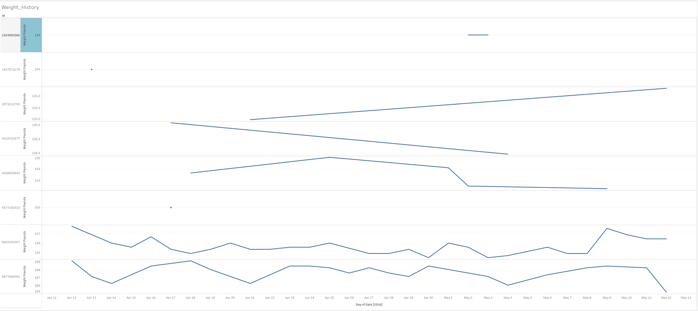

# Google Certificate: Bellabeat CaseStudy
by Kevin L

Date: September 6, 2023

  **Objective**:
  Complete a Case Study by analyzing data of Fitbit users to provide insights to a growing women's wellness start-up.

 SCENARIO 

Role-play as a junior data analyst working on the marketing analyst team at Bellabeat, a high-tech manufacturer of
health-focused products for women. Bellabeat is a successful small company, but they have the potential to become a larger
player in the global smart device market. You have been asked to focus on one of Bellabeat’s products and analyze smart device data to gain insight into how consumers are using their smart
devices. The insights you discover will then help guide marketing strategy for the company. You will present your analysis to
the Bellabeat executive team along with your high-level recommendations for Bellabeat’s marketing strategy.

Stakeholders: 
Urška Sršen: Bellabeat’s cofounder and Chief Creative Officer
Sando Mur: Mathematician and Bellabeat’s cofounder; key member of the Bellabeat executive team
Bellabeat marketing analytics team: A team of data analysts responsible for collecting, analyzing, and
reporting data that helps guide Bellabeat’s marketing strategy. You joined this team six months ago and have been
busy learning about Bellabeat’’s mission and business goals — as well as how you, as a junior data analyst, can
help Bellabeat achieve them 

 

 ASK 

1. What are some trends in smart device usage?
2. How could these trends apply to Bellabeat customers?
3. How could these trends help influence Bellabeat marketing strategy?

 ## Guiding questions
● What is the problem you are trying to solve?

● How can your insights drive business decisions?

## Key tasks
1. Identify the business task
2. Consider key stakeholder

   

 

 PREPARE 

   Download data source from Kaggle: [FitBit Fitness Tracker Data](https://www.kaggle.com/datasets/arashnic/fitbit)

   ## Key tasks
  1. Download data and store it appropriately.
  2. Identify how it’s organized.
  3. Sort and filter the data.
  4. Determine the credibility of the data.

**Findings:**
Data is downloaded into my PC and uploaded to my [BigQuery Workspace](https://console.cloud.google.com/bigquery?pli=1&project=coral-burner-397615&supportedpurview=project&ws=!1m9!1m4!1m3!1scoral-burner-397615!2sbquxjob_7a74ac93_18a4c56c33b!3sUS!1m3!3m2!1scoral-burner-397615!2sWellness), as well as my personal GoogleDrive

Data is organized in a combination of long and wide data. There are 18 separate .csv files, each containing multiple data points all connected by the primary key: "Id". The "Id" is the user's Id number, and the database contains information on their activity per day, heart-rate, calories burned, BMI, steps, etc.
After sorting and filtering the data, I found out that there are actually 33 distinct users, whereas the database description mentions only 30 users. 

SQL code below to find number of distinct users:

SELECT DISTINCT Id  
FROM `coral-burner-397615.Wellness.Activity` 

Regarding credibility, the data seems to be credible based on author and ethics of how the data was obtained. There are a few concerns worth noting for the ourposes of this case study:
First, 33 users is a very small smaple size and is highly susceptible to bias and outliers skewing the analysis. Idealy, the sample size is close to 75-100 as there are millions of Fitbit users and 33 is a very small percentage of the population.

Secondly, this case-study is designed for a company with a **women-centric** business model. However, the Fitbit Database is not clear as to the gender distribution of it's users. In other words, it would be important to know of the users of the database are mostly women are men. The database might not be too helpful if most of the users were male as women and men have different metabolism that affect weight, calories burned, etc.

 

 

 PROCESS 

Key tasks
1. Check the data for errors.
2. Choose your tools.
3. Transform the data so you can work with it effectively.
4. Document the cleaning process

**Findings:**
This case study was my first time using SQL to analyze and process data. When importing .csvc files from my PC onto BigQuery, I noticed an error that kept appearing:

### Failed to create table: Error while reading data, error message: Could not parse '4/12/2016 2:47:30 AM' as TIMESTAMP for field date (position 1) starting at location 21 with message 'Invalid time zone: AM' 

I assumed this error was due to "AM/PM" as a string causing issues with the time/date format.
I fixed this issue by removing the AM/PM from this column, using the "Find/Replace" tool in Excel. 
After transforming the dta in Excel, I imported it again into my SQL database and re-named it to avoid confusion with the original.
BigQuery Database again for refernece [here](https://console.cloud.google.com/bigquery?pli=1&project=coral-burner-397615&supportedpurview=project&ws=!1m10!1m4!1m3!1scoral-burner-397615!2sbquxjob_7a74ac93_18a4c56c33b!3sUS!1m4!4m3!1scoral-burner-397615!2sWellness!3sCalories)

I used BigQuery to analyze and manipulate the data with SQL, Tableau to create my visualizations, and Github to document my progress and add important notes for future use.
I also used GoogleSheets to help filter data for smaller .csv files, as I found that easier than using SQL.

 

 ANALYZE 

Key tasks
1. Aggregate your data so it’s useful and accessible.
2. Organize and format your data.
3. Perform calculations.
4. Identify trends and relationships.

**Findings:**
The first thing I wanted to examine was any trends regarding weight. 
Preview of Weight table below:

| Id	| Date | WeightPounds |
| -------------  | -------------  | -------------  |
| 1503960366 |	5/2/2016	| 115.9631465 |
| 1503960366 |	5/3/2016	| 115.9631465 |
| 1927972279 |	4/13/2016	| 294.31712 |
| 2873212765 |	4/21/2016	| 125.0021043 |
| 2873212765 |	5/12/2016	| 126.3248746 |
| 4319703577 |	4/17/2016	| 159.6146812 |
| 4319703577 |	5/4/2016	| 159.3942223 |
| 4558609924 |	4/18/2016	| 153.66219 |
| 4558609924 |	4/25/2016	| 154.984977 |

I noticed that there were only 8 unique users that tracked weight. SQL code below:

SELECT COUNT (DISTINCT Id) as UniqueId
 FROM `coral-burner-397615.Wellness.RealWeight`

This stood out as being a very low sample size to me, but I was still interested so I created a line chart for it to track weight over time. See "SHARE" Tab for visualization.

Next I wanted to track meaningful activity minutes, which I perceived as VeryActiveMinutes + FairlyActiveMinutes. In the 'Activty' speadsheet, I created a formula in SQL to combine these minutes to get the sum of active minutes.
SQL code below:

SELECT Id, ActivityDate, (VeryActiveMinutes + FairlyActiveMinutes ) as ActiveMinutes 
FROM `coral-burner-397615.Wellness.Activity` 

Preview of updated table below:

| Id	| Date | ActiveMinutes |
| -------------  | -------------  | -------------  |
| 8053475328 |	4/12/2016 |	124 |
| 8053475328	| 4/13/2016 |	107 |
| 8053475328	| 4/14/2016 |	124 |
| 8053475328	| 4/15/2016 |	140 |
| 8053475328	| 4/17/2016 |	132 |

Now that I had a summary of how active users were, it was time to examine users who had no activity.

SQL code below:

SELECT Id, COUNTIF(FairlyActiveMinutes + VeryActiveMinutes = 0) as NoActivityDays
FROM `coral-burner-397615.Wellness.Intensity` 
GROUP BY Id

The above code takes the sum of Fairly Active and Very Active Minutes columns, and returns a TRUE value if the sum is zero. Then it groups each instance by user ID. Preview of table result below:

| Id	| NoActivityDays |
| -------------  | -------------  |
| 4020332650	| 23 |
| 8877689391	| 1 |
| 6962181067	| 6 |
| 1644430081	| 9 |
| 2022484408	| 2 |
| 2347167796	| 4 |
| 3977333714	| 1|

Next, I wanted to analyze calories burned. Here, it is hard to determine how the calories burned by exercise is measured, since the human body naturally burns calories in a resting state. In this context, it is also important to remeber that men and woment burn calories differently:

Per the [Cleveland Clinic](https://health.clevelandclinic.org/calories-burned-in-a-day/), women burn around 1,500 calroies a day, whereas men burn around 2,000, without factoring any calories burned through exercise. As I mentioned before, it would be helpful to know which users were men and woment to create a more accurate metric.
As an assumption, I set 1,500 calories as the standard, so any day where a user burned less than 1,500 calories would be flagged. SQL code below:

SELECT Id, COUNTIF(Calories < 1500) as LowCalories
FROM `coral-burner-397615.Wellness.Calories_Sub_1500`
GROUP BY Id
ORDER BY LowCalorIes DESC

This SQL code counts how often a user burned less than 1,500 calories on any guven day, and then sorted it in Descendingf order.

Preview of results:

| Id | LowCalories |
| -------------  | -------------  |
| 1624580081	| 23 |
| 2026352035	| 14 |
| 1844505072	| 14 |
| 3977333714	| 9 |
| 2320127002	| 6 |
| 6117666160	| 6 |
| 5553957443	| 4 |

It might seem obvious, but my analysis shows that the 33 fitbit users were, overall, fairly active. Most users logged data in their Fitbit fairly regularly. The majority of users logged days which I categorized as active; there seems to be a correlation between people who purchase Fitbits and their desire to start or mantain a healthy lifestyle.

 

  

 SHARE 

## Guiding questions
● Were you able to answer the business questions?
● What story does your data tell?
● How do your findings relate to your original question?
● Who is your audience? What is the best way to communicate with them?
● Can data visualization help you share your findings?
● Is your presentation accessible to your audience?
## Key tasks
1. Determine the best way to share your findings.
2. Create effective data visualizations.
3. Present your findings.
4. Ensure your work is accessible.

## FINDINGS

My findings tell a story of users who care about tracking their wellness, but also a signifigant number of users with a lack of tracking activity. The majority of users seem to maintain healthy habits, but perhaps there are users who find it dufficult to track data.

For example, the below table is a visualization of usres who are tracking their weight over the one month time period. The first important observation is that only a minority of the 33 registered users chose to track their weight. In addition, only a handful of these users engaged in regular weight tracking; a few users only logged their weight once or twice.

The next visualization depicts the number of active days each user logged. "Active" is defined by having done at least 60 minutes of moderate to vigorous activty at least twice a week, as recommended by the [WHO](https://www.who.int/news-room/fact-sheets/detail/physical-activity).
Here, we see a slight majority towards people who were living an active lifestyle. This supports my hypothesis that people who are using Fitbit generally have a desire or purpose to maintain an active lifestyle.

Lastly, I wanted to also track data regarding sleep. Sleep is a fundamental aspect of a healthy lifestyle. The [MAYO Clinic](https://www.mayoclinic.org/healthy-lifestyle/adult-health/expert-answers/how-many-hours-of-sleep-are-enough/faq-20057898) suggests at adults should engage in at least 7 hours of deep sleep to prevent serious issues such as stress, weight gain, depression, and heart disease. Adults should get no more than 2,900 minutes of sleep a week (7 hours a day). We see another case where not all users 33 users are logging their sleep schedules.

 

 
 

 **ACT 

 

